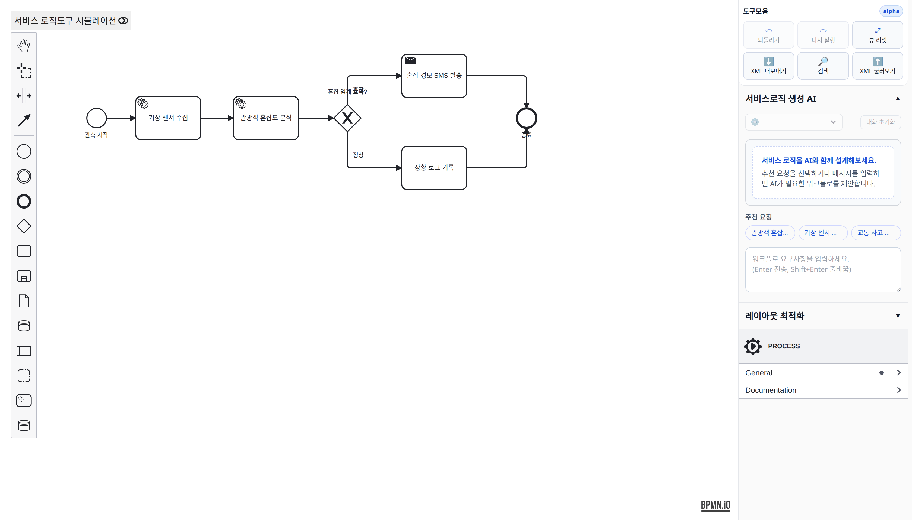
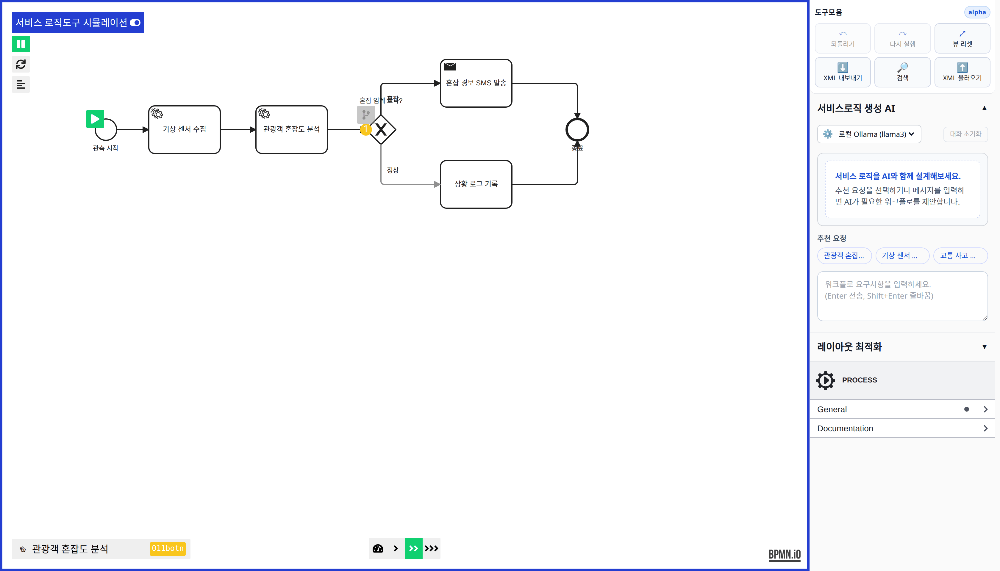
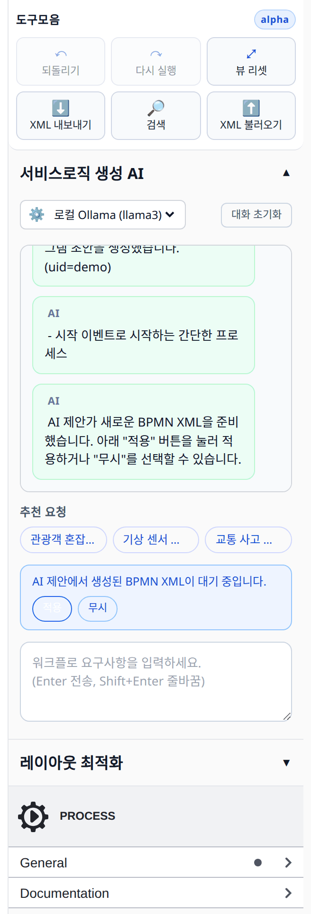

# SLCT — 서비스 로직 생성 도구

> **디지털 연합트윈 서비스 로직 생성 도구(SLCT)** 는 BPMN 기반으로 서비스 로직을 설계·편집하고, 시뮬레이션 해석을 위한 로직을 효율적으로 생성하도록 지원합니다.

<p align="center">
  
</p>

---

## 개요

웹 에디터에서 BPMN 다이어그램을 편집·시뮬레이션하고, 백엔드가 다이어그램을 저장하며, 프로세서가 데이터/ML 파이프라인을 실행하는 3-tier 구조입니다.

| 구성 요소 | 기술 스택 | 포트 | 역할 |
|---|---|---|---|
| **frontend** | Vue 2.7 · Vite · bpmn-js (pnpm) | `9900` | BPMN 다이어그램 편집·시뮬레이션·AI 코파일럿 UI |
| **backend** | Django 5 · DRF (Python) | `1337` | 다이어그램·LLM·디지털트윈·파이프라인 REST API |
| **processor** | Flask · tsai · datasets (Python) | `9901` | BPMN 이벤트 기반 데이터/ML 파이프라인 처리 |

프론트엔드는 `/api`로 백엔드를 호출하고, 시뮬레이션 토큰이 흐를 때 다이어그램에 설정된 URL(프로세서 등)을 직접 호출합니다.

---

## 주요 기능

- **BPMN 다이어그램 편집** — 노드 추가·삭제·연결, XML 저장/불러오기, 색상·속성 패널.
- **로직 시뮬레이션** — 토큰 시뮬레이션으로 실행 흐름을 시각화하고 외부 엔드포인트를 호출.
- **AI 코파일럿** — 자연어 요구사항으로 다이어그램 초안을 생성(LLM 연동). 좌표가 없는 XML은 자동 레이아웃으로 노드를 배치합니다.
- **디지털 트윈 연동** — 디지털트윈 메타데이터·시뮬레이터 소스를 활용한 동적 로직 구성.
- **배포 지원** — Docker Compose 및 Kubernetes 매니페스트 제공.

---

## 화면

**토큰 시뮬레이션** — 프로세스 실행 흐름을 토큰 애니메이션으로 시각화하고, 단계별로 외부 엔드포인트를 호출합니다.

<p align="center">
  
</p>

**AI 코파일럿** — 자연어 요구사항을 입력하면 BPMN 초안을 생성하고, 결과를 다이어그램에 적용하거나 무시할 수 있습니다. 생성된 XML에 좌표 정보가 없어도 자동 레이아웃으로 노드를 배치합니다.

<p align="center">
  
</p>

---

## 프로젝트 구조

```
src/
├── frontend/         Vue + Vite + bpmn-js 에디터
├── backend/          Django + DRF API 서버 (앱: bpmns, digitaltwins, llm, pipelines)
├── processor/        Flask 데이터/ML 파이프라인
├── k8s/              Kubernetes 매니페스트 (backend / frontend / processor / ingress)
└── docker-compose.yml
```

> 실제 코드는 모두 `src/` 하위에 있습니다.

---

## 빠른 시작 (Docker Compose)

```bash
cd src

# 각 서비스는 .env 를 읽습니다. 최초 1회 샘플을 복사하세요.
cp backend/.env.example  backend/.env
cp frontend/.env-sample  frontend/.env
cp processor/.env-sample processor/.env

docker compose up --build -d
```

- 프론트엔드: http://localhost:9900/<다이어그램id>
- 백엔드 API: http://localhost:1337/api
- API 문서(Swagger): http://localhost:1337/api/docs/

---

## 로컬 개발

### 프론트엔드 (Node 18+, pnpm)
```bash
cd src/frontend
pnpm install
pnpm dev          # http://0.0.0.0:9900
```

### 백엔드 (Python, Django)
```bash
cd src/backend
python -m venv .venv
source .venv/bin/activate          # Windows: .venv\Scripts\activate
pip install -r requirements.txt
python manage.py migrate
python manage.py runserver         # http://0.0.0.0:1337
```
- 기본 DB는 `src/backend/db.sqlite3` (환경변수 `DJANGO_DB_PATH`로 경로 변경 가능)
- 자세한 엔드포인트·모델 설명은 [src/backend/README.md](src/backend/README.md) 참고

### 프로세서 (Python, Flask)
```bash
cd src/processor
pip install -r requirements.txt
python3 main.py                    # http://0.0.0.0:9901
```

---

## API 호환성

백엔드 REST API는 `{"data": ..., "meta": ...}` 응답 구조와 `/api/bpmns`, `/api/feditscraper/json` 등의 경로를 제공하여, 프론트엔드 `ApiService`를 수정하지 않고 그대로 연동할 수 있도록 설계되었습니다. 백엔드를 수정할 때 이 응답 포맷을 유지해야 합니다. 엔드포인트 표는 [src/backend/README.md](src/backend/README.md)에 정리되어 있습니다.

---

## 배포 (Kubernetes / microk8s)

```bash
# 1) microk8s 준비
sudo snap install microk8s --classic
microk8s enable dashboard registry ingress

# 2) 이미지 빌드 & 로컬 레지스트리 푸시
cd src
docker build -t localhost:32000/bpmn-backend:latest   -f ./backend/Dockerfile   ./backend
docker build -t localhost:32000/bpmn-frontend:latest  -f ./frontend/Dockerfile  ./frontend
docker build -t localhost:32000/bpmn-processor:latest -f ./processor/Dockerfile ./processor
docker push localhost:32000/bpmn-backend:latest
docker push localhost:32000/bpmn-frontend:latest
docker push localhost:32000/bpmn-processor:latest

# 3) 배포
kubectl create namespace kt-bpmn
kubectl config set-context --current --namespace=kt-bpmn
kubectl apply -f ./k8s/backend.yaml
kubectl apply -f ./k8s/frontend.yaml
kubectl apply -f ./k8s/processor.yaml
kubectl apply -f ./k8s/ingress.yaml
```

> 로컬 레지스트리(`localhost:32000`)를 사용하려면 `/etc/docker/daemon.json`에
> `{ "insecure-registries": ["localhost:32000"] }`를 추가하고 Docker를 재시작하세요.

---

## Acknowledgments

This project uses [bpmn-js](https://github.com/bpmn-io/bpmn-js) and related tools, which are licensed under the [Apache 2.0 License](https://github.com/bpmn-io/bpmn-js/blob/develop/LICENSE).

---

## Funding

This work was supported by Institute of Information & communications Technology Planning & Evaluation (IITP) grant funded by the Korea government (MSIT) (No.2022-0-00431, Development of open service platform and creation technology of federated intelligent digital twin, 100%).
